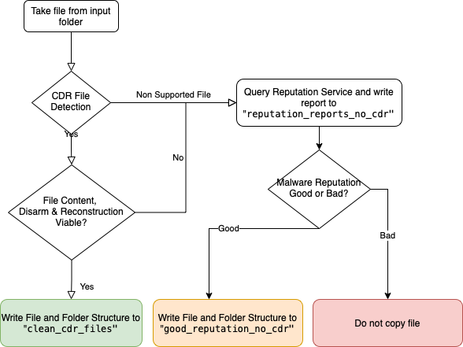

# Glasswall CDR & File Reputation Check

## Purpose

The script expects potentially malicious files to exist in a folder named, "input".

- Files are presented to the Glasswall CDR Platform REST API for processing. The output of the CDR step is sent to a folder named, "output/clean_cdr".

- If that files cannot be processed or is unsupported, the file is checked by the reputation service to determine if the file hash is known in any malware databases.

- Only if reputation is not malicious, will a copy of the file be placed into a folder named, "output/good_reputation_no_cdr".

- The reputation reports of files which could not be processed by the CDR step, will be recorded in a folder named, "output/reputation_reports_no_cdr". Within this folder, "good_reputation_files_no_cdr" and "bad_reputation_files_no_cdr" subfolders contain the applicable reports. No potentially malicious files are contained in the reporting folders. The output of the reports can be switched-off by changing the value of 'CREATE_REPUTATION_REPORTS' to 'False'. The format of these reports can be XML or JSON and this can be controlled by editing the value of 'CDR_REPORT_FORMAT'.

- The script will detect the true file type using the Glasswall CDR engine. Sometimes an attacker will use a different file extension to evade a filter. Glasswall will determine the true file type, looking at the structure of the data inside the file. Files with unstructured data, such as '.txt' files are not supported by Glasswall as they can be used by an attacker insert malicious software.

- Converting the contents of a text file to a file format such as PDF is a usability option, as that file has an associated specification which facilitates the CDR process. However, if the original '.txt' file contained a malicious script, that would still be visible in the PDF visual layer, (although not active). So the conversion would not eliminate all possible risk, but would mitigte the liklihood that a malicious script with a '.txt' extension could have it's file extension changed to a executable type.

- The script enables the (1) creation of files which have been CDR'd and (2) to produce accompanying analysis reports. Either step can be switched-off by setting 'CREATE_CDR_ANALYSIS_REPORTS' and  'CREATE_CDR_FILES' values to 'False'.

## Process Flow



## Setup

requirements.txt provides a list of python libraries that are needed

.env file should exist and contain the following key value pairs:

```text
#env variables
TICLOUD_USERNAME = "<insert>"
TICLOUD_PASSWORD= "<insert>"
```

## FAQs

- Q: What is the Reputation service?
- A: The service discloses if a scanner has deemed the file to be malicious previously. The look-up uses a SHA256 hash to match adverse findings about the file in question. The file is not actively scanned for malware. The information that is returned relates only to its reputation, which is informed by previous assessments by third parties.

- Q: If I rely on a Reputation Service is there is risk?
- A: A malicious file may enjoy a reputation that is not adverse for a period of time, which is usually because the security community has not yet determined the threat. There is a risk in relying solely on the reputation of a file. Ideally other countermeasures such as CDR or Sandboxing would be employed.

- Q: Who provides the Reputation Service
- A: ReversingLabs - `https://www.reversinglabs.com`

- Q: Is the Reputation Service free for commercial use?
- A: No. A Licence must be purchased

- Q: Why does the CDR step sometimes fail?
- A: Occasionally, if the file is badly broken and does not sufficiently conform to a file specification, safe file reconstruction may be prevented. Whilst a document parser *may* be able to open a non-conforming file and represent its contents, a bad actor may be relying on a vulnerability in the parser or local environment to mount an attack.
